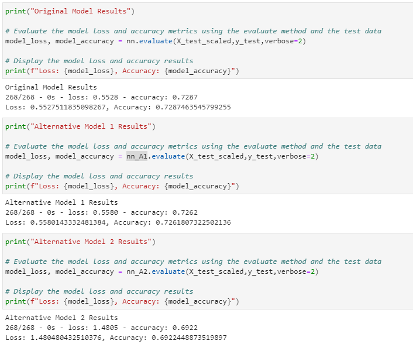

# Challenge13

# Venture Funding with Deep Learning

This is a Jupyter notebook predicts whether Alphabet Soup funding applicants will be successful by creating a binary classification model using a deep neural network.

---

## Technologies

This project leverages Python 3.7, scikit-learn, and tensorflow with the following packages and dependencies:

* [pandas](https://pandas.pydata.org/) - An open-source data analysis and manipulation tool

* [pathlib](https://docs.python.org/3/library/pathlib.html) - Used to identify a file using absolute or relative path

* [tensorflow](https://www.tensorflow.org/) - An open source library to help develop and train Machine Learning models

* [sklearn.model_selection](https://scikit-learn.org/stable/modules/generated/sklearn.model_selection.train_test_split.html) - Split arrays or matrices into random train and test subsets

* [sklearn.preprocessing](https://scikit-learn.org/stable/modules/preprocessing.html) -  provides several common utility functions and transformer classes to change raw feature vectors into a representation that is more suitable for the downstream estimators

---

## Installation Guide

Python 3.7, GitBash, sklearn, tensorflow, and JupyterLab are required to be installed before running the application.

---

## Usage

To run the application simply clone the repository and run the **venture_funding_with_deep_learning.ipynb** with:

```python
venture_funding_with_deep_learning.ipynb
```

Attached screenshot below shows the classification report result:

  

---

## Contributors

Brought to you by Christine Guo (www.linkedin.com/in/christine-guo)

---

## License

NoNe